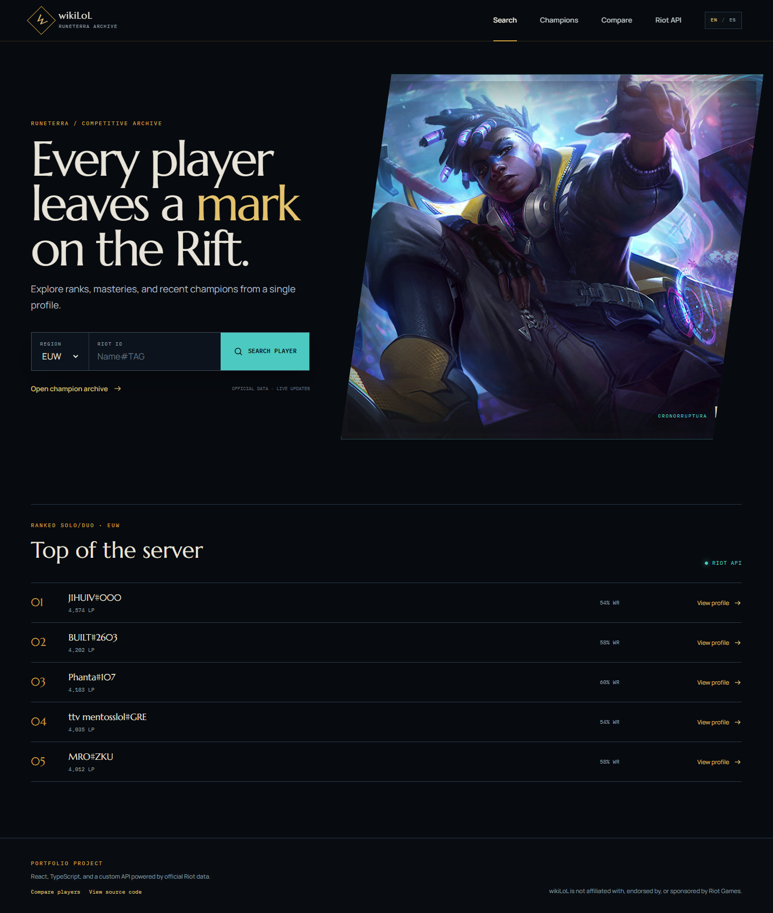
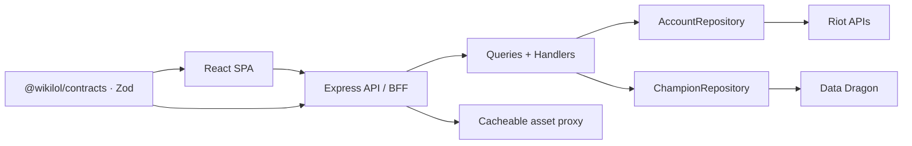

# wikiLoL

[Versión en español](./README.es.md)

[](https://github.com/kevin0018/wikiLoL/actions/workflows/ci.yml)

A full-stack League of Legends application for exploring and comparing player
profiles, ranks, champion masteries, and champion data.

[Live demo](https://wiki-lol-k.vercel.app/) ·
[Riot Developer Portal](https://developer.riotgames.com/apis)

[](https://wiki-lol-k.vercel.app/)

## Highlights

- Look up a Riot ID to view its level, ranked standings, and champion masteries.
- Compare two players—even across different regions—through a shareable URL.
- Browse the current and LoL Classic champion rosters, filter them by role, and
  open each champion's lore and skin gallery.
- Use the interface in English or Spanish, with browser-language detection and
  a persisted manual preference.
- Check the EUW Challenger leaderboard directly from the home page.

The interface has a custom visual direction inspired by the archives of
Runeterra. It is more than a thin layer over Riot's APIs: the application owns
its public contracts, error handling, caching strategy, and visual assets.

## Architecture



The browser never contacts Riot directly or needs to know the active Data
Dragon version. The backend composes the data, validates upstream responses,
and proxies every visual asset.

### Decisions worth reviewing

- Shared Zod contracts between the frontend and backend without leaking Riot's
  internal models to the client.
- CQRS-style use cases, with dependencies wired from a single composition root.
- Value objects for regions and queue types before data reaches infrastructure.
- Validation for every upstream response and consistent HTTP error translation.
- Caching for the Data Dragon version, resolved Riot IDs, and assets exposed
  through stable URLs.
- Purpose-built loading, error, empty, and reduced-motion states.

## Stack

- **Workspace:** pnpm
- **Frontend:** React 19, TypeScript, Vite, TanStack Query, Motion, and Tailwind CSS
- **Backend:** Node.js, Express 5, TypeScript, and Zod
- **Contracts:** shared `@wikilol/contracts` package
- **Application:** one `Query` and `Handler` per CQRS use case
- **Testing:** Vitest and Supertest

## Project structure

```text
wikiLoL/
├── frontend/                  # React + TypeScript SPA
├── backend/                   # Express API and Riot proxy
├── packages/
│   └── contracts/             # Shared DTOs, Zod schemas, and types
├── tokens.css                 # Interface design tokens
├── package.json
├── pnpm-workspace.yaml
└── tsconfig.base.json
```

The shared contracts describe the public API exclusively. Internal Riot and
Data Dragon responses remain encapsulated in the backend. Routes validate
input and dispatch queries; handlers depend on `AccountRepository` or
`ChampionRepository`, with adapters provided by a single composition root.
`Region` and `QueueType` are domain value objects created by the HTTP layer
after validating its DTOs with Zod.

## Local development

Requirements:

- Node.js 22 or newer
- pnpm 10
- A Riot API key for player and leaderboard routes

Install all dependencies from the repository root:

```bash
pnpm install
```

Create `backend/.env`:

```dotenv
RIOT_API_KEY=RGAPI-...
PORT=3000
```

Optionally create `frontend/.env` when the backend is hosted on a different
origin:

```dotenv
VITE_BACKEND_URL=http://localhost:3000
```

Start the frontend and backend:

```bash
pnpm dev
```

- Frontend: `http://localhost:5173`
- Backend: `http://localhost:3000`

## Commands

```bash
pnpm typecheck
pnpm test
pnpm build
```

The production build runs in dependency order: contracts, backend, then
frontend.

## Vercel deployment

The application deploys as a single Vercel project: the SPA is served from `/`,
while Express handles every `/api/*` route through a Function.

1. Import the repository and keep the project root set to `./`.
2. Add `RIOT_API_KEY` to the Production, Preview, and Development environments.
3. Leave `VITE_BACKEND_URL` unset so the frontend uses the same-origin API.
4. Deploy. `vercel.json` already configures pnpm, the build, Vite's output,
   React Router's fallback, and the Express Function.

Before removing previous deployments, verify these routes on the new URL:

- `/`
- `/champions/Akali`
- `/api/champions`
- `/api/league/challenger?region=EUW&count=5`

## API

| Route | Description |
| --- | --- |
| `GET /api/meta` | Current Data Dragon patch |
| `GET /api/champions` | Current and LoL Classic champion rosters |
| `GET /api/champions/:id` | Champion lore and skins |
| `GET /api/account/profile` | Player profile by Riot ID |
| `GET /api/account/rank` | Player ranked standings |
| `GET /api/account/mastery` | Highest champion masteries |
| `GET /api/account/most-played` | Most-played champions from recent matches |
| `GET /api/league/challenger` | Challenger leaderboard |
| `GET /api/assets/*` | Cacheable image proxy |

The backend discovers and caches the current Data Dragon version. Public asset
URLs remain stable and do not expose the patch number.

## Legal notice

League of Legends, its characters, images, and related data are property of
Riot Games, Inc. wikiLoL is not affiliated with, endorsed by, or sponsored by
Riot Games. This repository is a non-commercial personal and educational
project.
