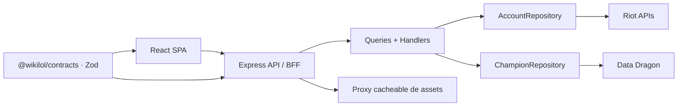

# wikiLoL

Aplicación full stack para consultar y comparar perfiles, rangos, maestrías y
campeones de League of Legends.

[Explorar el código](https://github.com/kevin0018/wikiLoL) ·
[Riot Developer Portal](https://developer.riotgames.com/apis)

## Qué puedes hacer

- Buscar un Riot ID y consultar su nivel, clasificación y maestrías.
- Comparar dos jugadores —incluso de regiones distintas— mediante una URL
  compartible.
- Recorrer los catálogos actual y LoL Classic, filtrarlos por rol y abrir el
  lore y la galería de aspectos de cada personaje.
- Consultar la clasificación Challenger de EUW desde la portada.

La interfaz utiliza una dirección visual propia inspirada en los archivos de
Runaterra. No es una capa directa sobre la API: la aplicación controla sus
contratos, errores, caché y recursos visuales.

## Arquitectura



El navegador nunca contacta directamente con Riot ni conoce la versión de Data
Dragon. El backend compone los datos, valida las respuestas externas y actúa
como proxy de todos los assets.

### Decisiones que merece la pena revisar

- Contratos Zod compartidos entre frontend y backend sin filtrar modelos
  internos de Riot al cliente.
- Casos de uso organizados con CQRS y dependencias conectadas desde un único
  composition root.
- Value objects para región y tipo de cola antes de alcanzar infraestructura.
- Validación de todas las respuestas externas y traducción consistente de
  errores HTTP.
- Cacheado de la versión de Data Dragon, Riot IDs resueltos y assets servidos
  desde URLs estables.
- Estados de carga, error, vacío y movimiento reducido en la interfaz.

## Stack

- **Workspace:** pnpm
- **Frontend:** React 19, TypeScript, Vite, TanStack Query, Motion y Tailwind CSS
- **Backend:** Node.js, Express 5, TypeScript y Zod
- **Contratos:** paquete compartido `@wikilol/contracts`
- **Aplicación:** CQRS con `Query` y `Handler` por caso de uso
- **Tests:** Vitest y Supertest

## Estructura

```text
wikiLoL/
├── frontend/                 # SPA React + TypeScript
├── backend/                  # API Express + proxy de Riot
├── packages/
│   └── contracts/            # DTOs, esquemas Zod y tipos compartidos
├── tokens.css                 # Tokens de la interfaz
├── package.json
├── pnpm-workspace.yaml
└── tsconfig.base.json
```

Los contratos compartidos representan exclusivamente la API pública. Las
respuestas internas de Riot y Data Dragon permanecen encapsuladas en el
backend. Las rutas validan la entrada y despachan queries; los handlers
dependen de `AccountRepository` o `ChampionRepository` y reciben los
adaptadores desde un único composition root. `Region` y `QueueType` son value
objects del dominio; la capa HTTP transforma hacia ellos después de validar los
DTO con Zod.

## Desarrollo

Requisitos:

- Node.js 22 o superior
- pnpm 10
- Una API key de Riot para las rutas de jugadores y clasificación

Instala todas las dependencias desde la raíz:

```bash
pnpm install
```

Crea `backend/.env`:

```dotenv
RIOT_API_KEY=RGAPI-...
PORT=3000
```

Opcionalmente, crea `frontend/.env` si el backend no se encuentra en el mismo
origen:

```dotenv
VITE_BACKEND_URL=http://localhost:3000
```

Inicia frontend y backend:

```bash
pnpm dev
```

- Frontend: `http://localhost:5173`
- Backend: `http://localhost:3000`

## Comandos

```bash
pnpm typecheck
pnpm test
pnpm build
```

El build se ejecuta en orden: contratos, backend y frontend.

## Despliegue en Vercel

La aplicación se despliega como un único proyecto de Vercel: la SPA se sirve
desde `/` y Express atiende todas las rutas `/api/*` en una Function.

1. Importa el repositorio y deja la raíz del proyecto en `./`.
2. Añade `RIOT_API_KEY` en Production, Preview y Development.
3. No definas `VITE_BACKEND_URL`; el frontend utiliza la API del mismo origen.
4. Despliega. `vercel.json` ya configura pnpm, el build, la salida de Vite,
   el fallback de React Router y la Function de Express.

Antes de retirar despliegues anteriores, comprueba en la nueva URL:

- `/`
- `/champions/Akali`
- `/api/champions`
- `/api/league/challenger?region=EUW&count=5`

## API

| Ruta | Descripción |
| --- | --- |
| `GET /api/meta` | Parche actual de Data Dragon |
| `GET /api/champions` | Archivo de campeones |
| `GET /api/champions/:id` | Lore y aspectos de un campeón |
| `GET /api/account/profile` | Perfil por Riot ID |
| `GET /api/account/rank` | Rangos por invocador |
| `GET /api/account/mastery` | Mejores maestrías |
| `GET /api/account/most-played` | Campeones de partidas recientes |
| `GET /api/league/challenger` | Clasificación Challenger |
| `GET /api/assets/*` | Proxy cacheable de imágenes |

La versión actual de Data Dragon se descubre y cachea en el backend. Las URLs
públicas de assets son estables y no contienen el parche.

## Aviso legal

League of Legends, sus personajes, imágenes y datos relacionados son propiedad
de Riot Games, Inc. wikiLoL no está afiliado, respaldado ni patrocinado por
Riot Games. Este repositorio es un proyecto personal y educativo sin fines
comerciales.
